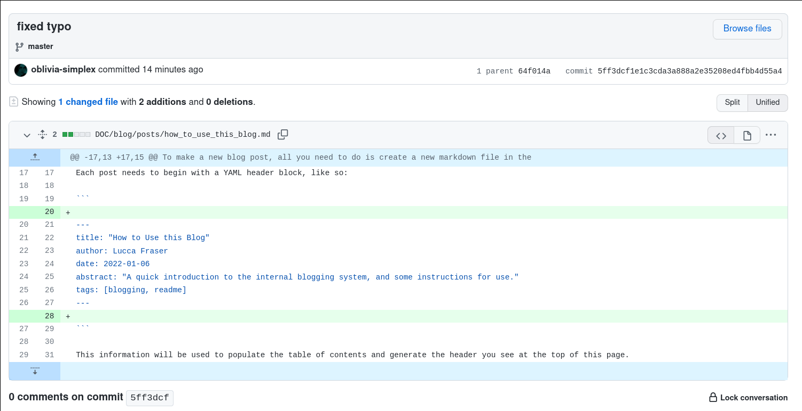

Hi, everybody. 

I've set up this blogging platform so that we can keep one another up to date on the various limbs of the REFUSR project.

## How to make a new blog post

To make a new blog post, all you need to do is create a new markdown file in the `REFUSR` repo under the `DOC/blog/posts` directory.

Each post needs to begin with a YAML header block, like so:

```

---
title: "How to Use this Blog"
author: Olivia Lucca Fraser
date: 2022-01-06
abstract: "A quick introduction to the internal blogging system, and some instructions for use."
tags: [blogging, readme]
---

```

This information will be used to populate the table of contents and generate the header you see at the top of this page.

Images and other media resources can be stored in the `DOC/blog/img` directory.

The blogging engine itself is a little hobby project of mine called [P'log](https://github.com/oblivia-simplex/plog), which I've included as a submodule under the REFUSR repo. It lives in the `DOC/blog/plog` directory. Best to leave that alone, but if you have any bugs or feature requests, feel free to shoot me a github issue.

Under the `DOC/blog/plog` directory, there's a symbolic link named `content`, which points to `..`, that is, to the `DOC/blog` directory. Internal markdown links can be pointed at anything that lives under that directory, but the rest of the repo is invisible to P'log, assuming that there are no directory traversal bugs that've slipped my notice.

Posts that aren't quite ready for prime time can be marked with the `draft` tag, which will hide them from the table of contents. This shouldn't be considered a *secure* way to hide information. It's a privacy hedge and nothing more than that.

## What to use this blog for

I'd like each of us to get into the habit of contributing a post every week or two, at a minimum. If you have more than one topic to discuss, please feel free to carve it up into multiple posts.

Use these posts to discuss what it is you're working on, in detail. Some of the various forms these contributions might take include:

- obstacles, conceptual or practical
- open questions
- TODO lists
- internal feature requests (is there something you wish module X could do?)
- possibilities for applications, tech transfer, etc.
- experimental results
- planned experiments
- conjectures
- benchmarks
- code or hardware documentation

I've set up a subdomain at `refusr.eschatronics.ca` to host this site for now, with a fairly standard htpasswd style authentication mechanism. If you're reading this, you already know that. The reason for gating this blog behind a password is just to relieve the pressure that comes with public visibility. I want us to be able to post here without worrying too much about sprucing things up for an outside audience. If there's any demand for a public facing blog as well, we can certainly spin one of those up, too.

## Comments

While P'log doesn't boast native support for comments, Github does! At the bottom of each post, you'll see a commit hash. If you click it, it should take you to the corresponding commit in the [REFUSR Github repo](https://github.com/REFUSR/REFUSR). You should all have access to that by now. 


