# Introduction

Since the submission of our third milestone report, we've been working towards the integration of the three principal modules of the REFUSR project: the hardware interface or "Refuduino PLC Whisperer", the "Cockatrice" genetic programming (GP) engine, and the probabilistic property testing (PPT) module.

We have set up the hardware interface in such a way as to allow the PLC to be queried as an oracle by the GP and PPT modules, respectively. The PPT module will provide possible constraints (in the form of property assertions), sampling policies, and a new type of distance metric to the GP module. The GP module will integrate the information provided by the two others, and use it to drive a genetic search for an expression that adequately specifies the behaviour of the PLC, as observed through the eyes of the Whisperer.


# Hardware Developments


The focus for this phase of the work has been a further exploration of the interactions of the OpenPLC code with the target MCU. Recall from our earlier work that the "Refuduino" hardware platform consists of a Raspberry Pi SBC running the OpenPLC software wired to an Arduino Nano microcontroller. A Symbolic Expression generated by the GA/Junta synthesizer is wrapped in a boilerplate Structured Text(ST) program which communicates to the Arduino MCU. Our initial approach took a classic data communications protocol approach with the use of the GPIO pins connected between the two devices to drive a clock and indicate state such as Ready-To-Send, Clear-To-Send, Result Ready, etc. and also to present a set of random values used to seed the values for the Symbolic Expression to compute over. 

While these sorts of protocols are suitable for low-level communication protocols such as SPI, I2C, or TTL serial communication, it has proven overly complex for this work. For one, the data being sent between the two devices is much more akin to a noise generator function than an actual data communication. There is no real meaning or value behind the order of bits being sent over the %IX  lines so there's no real need for synchronization between the two devices. This obviates the start/stop signals and the need for a clock pulse. This makes the role of the Arduino more akin to a "Numbers Station" or noise-generator. 

Given the original approach of treating the Arduino-side as a sort of "Busy Box" with multiple small functions that could be deployed against different PLC applications, we see this development as a gain of function vs reduction. This places it much closer to PLCs as they are deployed "in the wild", which listen and act on electrical signals sent across individual pins vs. streams of serial data multiplexed across a dedicated IO channel.


## Glitching 

Following the August PI meeting and the discussion regarding electrical glitching attacks on embedded processors with devices like the Chip Whisperer, we made some brief attempts at glitching the pins on the Refuduino. Using the signal generator on the SeeedStudio DSO (Digital Storage Oscilloscope)Nano, we were able to induce state changes on the state pins of the Refuidino and get the code to act on this manipulation. A square wave with a period of 100ms and 5V voltage was used. 

## Board Revisions

Following the August PI meeting and demonstration of our hardware, a soldered-down version of the Refuduino was built, using the same BOM as the initial breadboard-ed prototype (see figure {@fig:refuduinoV2}). Screw-terminals have been added to this build allowing the physical connections for signalling to be changed as the software was changed. Development is also proceeding on a second system using an ATMEGA 2560 MCU (figure {@fig:catamaran}). This processor has 56 GPIOs vs. the 13 of the Arduino Nano as well as 256K bytes flash memory vs 32K on the Nano. 

We continue to be interested in collaboration and/or feedback from other REFUSR participants and those engaged in the development of similar hardware. 


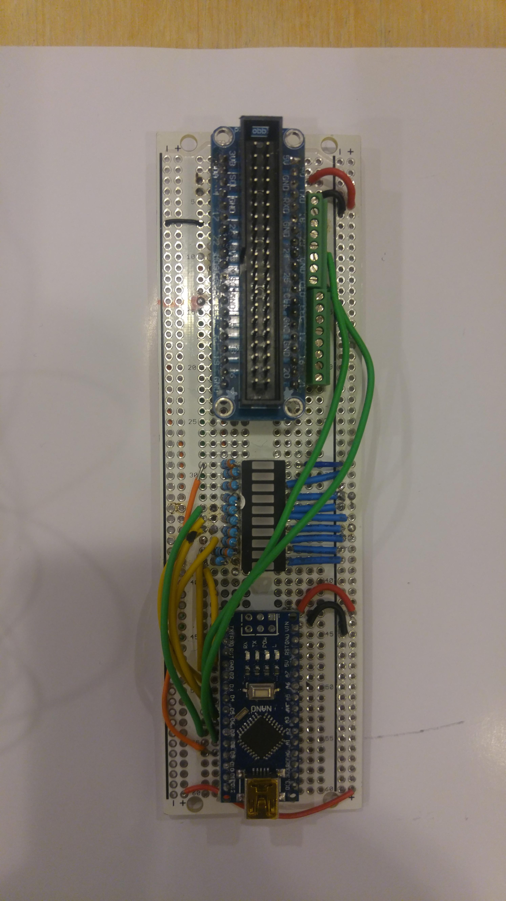{#fig:refuduinoV2}


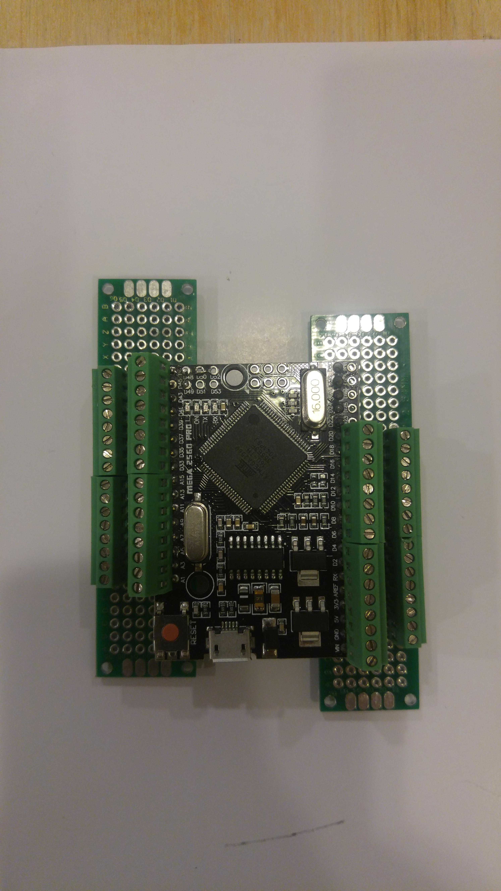{#fig:catamaran}


## Development of pin-level monitoring tools with Frida

The [OpenPLC](httsp://www.openplcproject.com) platform has proven to be a useful platform on which to base our initial round of PLC development. It's Open Source and has proven easy to setup and run our ST code on. It is still very much in development and has minimal logging and debugging facilities however.

To address these challenges we've developed some simple tools using [Frida](https://frida.re), a low-level inspection framework written in Javascript with Node.js, Python, Swift and C++ bindings, which is also Open Source.
There are currently two Python scripts `openplc-read-all-pins.py` and `openplc-read-set-pin.py` which use the [Frida Python module](https://pypi.org/project/frida/).

These tools have let us inspect and set pin-state on the Raspberry Pi GPIOs.
This not only provides a side inspection channel onto OpenPLC, it also gives us another point to establish an Oracle on the whole process.
We can copy the %IX pin states fed into the Symbolic Expression and store the evaluated result with the generated bitfield.
These following sections describe the trials and problems we encountered when developing these tools.

## GPIO pin numbering
One of the first problems we ran into when developing these tools, is that there exists at least four different "pin enumeration" schemes for the GPIO pins on the RPi.
There is the physical numbering (1-40), BCM numbering (which physical pin from the SoC its connected to, 0-27), wiringPis own numbering (0-29) and OpenPLCs numbering (%IXx.y for inputs and %IQx.y for outputs).
This posed a problem when actually trying to refer to what pin had what value, because the native pin numbering that wiringPi uses is its own numbering.
This meant that we had to make a translation table that translates the wiringPi numbers, to the OpenPLC numbers, to be able to make sense of the output without having to translate it manually when reading the output from the tools.

## Tooling OpenPLC with frida
One of the main problems we were having with the PLC code being run by OpenPLC, is that the debug functionality is near non-existent for OpenPLC.
OpenPLC has a small monitoring dashboard, that automatically is created to show the state/value of the different inputs and outputs.
The biggest problem with this dashboard, is that its refresh resolution doesn't go below 100ms, which is way too long cycles to be able to see any type of change in state on I/O between the restart of the task.
It was clear that we needed some other tool, that was able to read the I/O state in more of a real-time capacity than the provided monitoring dashboard.

There exists a library called [wiringPi](http://wiringpi.com/) that is widely used to read/write the GPIO pins available on the raspberrypi (RPi).
OpenPLC uses this library to use the GPIO pins to make a RPi into a PLC, and exposes these pins to PLC programs.
The pinout that OpenPLC uses can be shown [here](https://www.openplcproject.com/runtime/raspberry-pi/pinout.png) where it can be seen overlaid over the RPi physical pinout.

The option was between using the `gpio` cli tool that uses wiringPi to access the GPIO pins, write our own program utilzing wiringPi and instrument the compiled binary that OpenPLC creates when you upload a PLC program to it.
We chose the third choice mainly because if we have the frida harness already setup for the binary, if we want to glean more internal state than just the state of different GPIO pins, its easy to tweak the scripts we inject into the OpenPLC binary.
The other reason for instrumenting with frida, over using the already supplied gpio cli tool or writing our own cli tool using the wiringPi library, is that the main reason we needed another tool to view pin state other than the OpenPLC monitoring dashboard, with a higher resolution than 100ms.
Had we used the supplied gpio cli tool or written our own, we would have the problem of syncing our reading/writing of the GPIO pins in between the reading/writing that the OpenPLC binary was doing to not get clobbered or clobber the functioning of the OpenPLC binary.

There is also a cli tool that is provided by the frida framework, `frida-trace`, that can be used to trace arbitrary functions on arbitrary processes and was very helpful in poking around to see what information that could be gotten through the frida API.
However, even though it gives all the information in real-time, there is no way to format the output from that tool or to enrich the output like to translate the pin numbering to the OpenPLC pin numbering scheme.
Therefore we decided to use Frida to hook the digitalRead and digitalWrite functions that the OpenPLC binary uses, through fridas python API.
That way, we get the information about the state of the pins, at the same time that the OpenPLC binary gets/writes the information.

After doing a trial run with just hooking the digitalRead/digitalWrite functions and outputting whatever value that was gotten from that, it was evident that we needed to coalesce this data and output it at a fixed interval of our own choosing.
The reason for this is that the OpenPLC binary reads/writes all I/O pins at an interval that is approximately 20ms +- 5-10 ms, which means that the terminal running the tool very quickly gets spammed with values, which makes it near impossible to actually read any information.

## The tools
So far, two tools was made to help with debugging the pin state, one that continously outputs the coalesced pin state every second and one that allows reading/writing boolean values from/to pins.
They are publish in this [repository](https://github.com/lejonet/rpi-openplc-gpio-tools).
They are not limited to attaching to OpenPLC binaries to output the state of pins, any binary that uses the wiringPi library and its digitalRead/digitalWrite functions can be instrumented by them.
This is why the first positional argument of both tools is a PID or process name, and if none is given, it defaults to attaching to the process called "openplc" as that is the name of the binary that OpenPLC produces and runs.

The first tool, `openplc-read-all-pins.py`, was the only tool that was originally planned to be created, to create a cli-based dashboard-like tool akin to the monitoring dashboard that OpenPLC has through its web frontend.
But as we started trying to debug the PLC code that was running on the RPi, it became clear that we needed a tool to be able to read/write an individual pin because not everyone had access to the Refudino hardware.
Not having access to the Refudino hardware meant that there was no way to actually give the PLC program any inputs to test that part of the code.
Thus the second tool, `openplc-read-set-pin.py`, was made.
Unlike the `gpio` cli tool, the `openplc-read-set-pin.py` tool uses the OpenPLC numbering to choose which pin to read/write from.
This simplified the process of reading/writing pins that were of interest from the PLC codes perspective, because no translation between the different pin numbering schemes needed to be done.
The tool hooks the digitalRead/digitalWrite functions, just like `openplc-read-all-pins.py`, but exports them as python functions that can be used indepently from the usage in the OpenPLC binary.

## UI
One of the plans with these tools, is to refine the UI for at least the `openplc-read-all-pins.py` to some type of Terminal UI (TUI) that updates itself, instead of just outputting row after row in the terminal.
That way, the pin state changes could be shown in real-time without risking losing data because it scrolls past in the terminal too quick.

## Remote PLC Access

In order to enable remote access to the target PLC device, we have moved the Refuduino over to a Teensyboard 4.1 MCU. This is a 32-bit ARM M7 processor with 1024K RAM, 8MB in Flash memory and 55 GPIO pins as well as an onboard TI DP83825 which provides a 100Mbit Ethernet interface. This has allowed us to import the Arduino MODBUS TCP library into the Refuduino code and provide LAN/WAN access to the Refuduino MCU as well at the current TTL-serial output. In previous versions of the Refuduino code, the seed bits for the Symbolic Expression run on the OpenPLC server were randomly generated from an PRN that ran in the main Refuduino loop() code. The MCU remains attached to the OpenPLC server via its GPIO cable. Effectively, this places two MODBUS Servers on either side of the GPIOs, neither aware of the other. A TCP port-scan from either the Pi running OpenPLC or another client on the same network would certainly turn up multiple MODBUS servers, but in a production industrial environment this might escape notice. We have been able to successfully replicate the "Numbers station" functionality on the MCU as a Python script on a remote host, have it inject those values into the MCU via PyModBus and have them be recognized by the OpenPLC dashboard. 

As MODBUS has program-defined registers that pin states can be stored into or written from, we now have a way to store-and-forward GPIO states between the Refuduino and external agents.  

This takes the MCU from a place of acting as a simple target device for the OpenPLC server into one where it can fully interact with other inspection, logging and analysis tools commonly used in other areas of InfoSec. We are interested in possible further development of this tool with others either inside or outside the ReMath effort who might find it useful. The idea of a sort of "PLC Pineapple" or "PLC Pirate" widget is certainly appealing.

This additional network functionality, moreover, will allow our genetic symbolic regression and probabilistic property testing modules to *remotely* interact with the PLC. Architecturally, this affords us the possibility of running these computationally expensive processes in a distributed fashion, while providing continual access to the PLC over the network. Our Modbus-mediated API will allow these client programs to send input arguments to the PLC and retrieve the resulting output, an interaction that can be readily wrapped in a function interface, which will serve as the "oracle" for the property tester and the source of training data for the genetic programming engine.


# Advances in the Cockatrice GP Engine: Dirichlet Energy as a Search Gradient

Macready and Wolpert's well-known "No Free Lunch" theorem [@Wolpert1997NoFreeLunch] informs us -- counterintuitively, perhaps -- that not only is there no optimization or search algorithm that performs better than random search across all problem domains, but *that the average performance of **any** given search algorithm across all domains is equal*. Whatever better-than-random performance a particular algorithm finds in one domain is paid for in its performance in some other.

In our [Milestone 3 report](milestone_3.md), we showed that REFUSR is capable of reliably discovering programs that implement moderately complex Boolean functions, such as the randomized 4-to-1 Multiplexor, a function on the 6-dimensional Boolean hypercube, the randomized 8-to-1 Multiplexor, which lives on the 11-dimensional hypercube, and an assortment of randomly generated functions of similar size.

The fitness function used in those experiments was a weighted sum of three different measures:

1. the Hamming distance between the candidate program's output and the output of the target function, modified by a fitness sharing algorithm that makes the reward for each test case inversely proportionate to the frequency with which solutions for that case appear in the population 
2. the maximum *mutual information* obtaining between a candidate program's intermediate execution states and the target function's output vector
3. a simple parsimony score, which assigns an award inversely proportionate to the candidate program's length, intended to mitigate bloat


The situation that confronted us when we turned to the 6-bit parity problem looked quite different. If we left the system running for long enough, eventually an answer would sometimes be found, but an examination of the logs made this appear to be little more than dumb luck. None of the phenotypic traits we'd designed seemed to have discovered any reliable gradient in the fitness landscape, until the very end. As trivial as the solution to the problem might be for a human programmer to solve -- odd-parity is, after all, just an $n$-ary XOR, and even-parity its negation -- for our existing GP system, it was a needle in a haystack. The situation was even worse when we attempted to solve 11-bit parity, which brought the system to a standstill, each of our fitness metrics flatlined. What few successes we had depended on the cheap trick of reducing the system's primitive operations to just `XOR` and `MOV`, and even then it could take upwards of **26,000 tournaments** to find a solution.


![[parity-11-sans-dirichlet-plot.png]]

![[parity-11-sans-dirichlet-length.png]]

<!-- NEED PLOTS provide some details, throw up some plots -->
<!-- TODO: spin up another Pluto notebook to generate these plots? or just load them into the dashboard and use that. probably the latter. -->

This shouldn't have come as a great surprise. The genetic programming literature is scattered with references to *parity* being a particularly difficult problem to solve. The classic point of reference, on this score, is John Koza's 1992 tome, [@Koza1992GeneticProgrammingProgramming]. Koza recognized parity as a particularly difficult function to discover through evolutionary synthesis. Even in as few as four dimensions, the task proved arduous. 

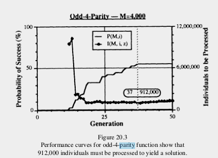
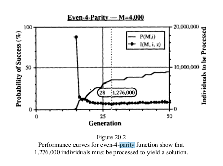

Without the support for modularity afforded by *automatically defined functions* (ADFs), genetic search for parity functions of higher dimensionality remained intractable. (With ADFs, he was able to reach 11-bit parity functions.)

But *why* is parity so difficult? What is it about that function in particular that makes it recalcitrant to genetic search, or, more precisely, to the measures we had so far implemented to track our evolving populations' proximity to their target? It's not a function of particularly great Komolgorov complexity, being in the end nothing more than an $n$-ary `XOR` or `IFF` (for odd and even parity, respectively).

What observation of our runs that *failed* to discover 11-bit parity show us, it seems, is that *at no point was a reliable gradient discovered*. Neither of the two fitness metrics we had provided at that point -- to wit:

+ hamming distance, modified by fitness sharing
+ maximal mutual information between intermediary states of the execution trace and the target

-- did anything but flatline in the face of 11-bit parity. If the parsimony pressure was allowed to remain in play, then the population would rapidly degenerate into single-instruction programs, typically constants. Even when we heavily biased the instruction set, stripping it of everything but `MOV` and `XOR` -- the minimal ingredients necessary to construct a simple solution -- success would arrive in the form of a long, uneventful flatline, suddenly punctuated by a lucky guess and a leap, somtimes two, before landing on the solution abruptly.

So what is it about *parity* that makes it so difficult to discover?

## Measures of Boolean Function Sensitivity

We brought this problem up in a conversation with Douglas Kutach, back in August, and reflected that what seemed most conspicuous about parity is its "volatility": changing any single bit of the input will change the output. This seemed like an interesting thread to pull on, and the ensuing path of research led me to the question of the *sensitivity of boolean functions*. 


<!-- TODO: consider moving this down to after the initial introduction of Sensitivity, and motivate it differently. that would give this section a smoother narrative arc! -->

The first idea that occurred to us was that it might be meaningful to classify a $n$-ary Boolean function $f$ by the number of maximal contiguous posets in the partition induced by $f$ on the lattice $\mathbb{B}^n$. 
 
The function $\& : \mathbb{B}^3 \rightarrow \mathbb{B}$, for example, partitions the Hasse graph of $\mathbb{B}^3$ into two subgraphs (two "contiguous posets").

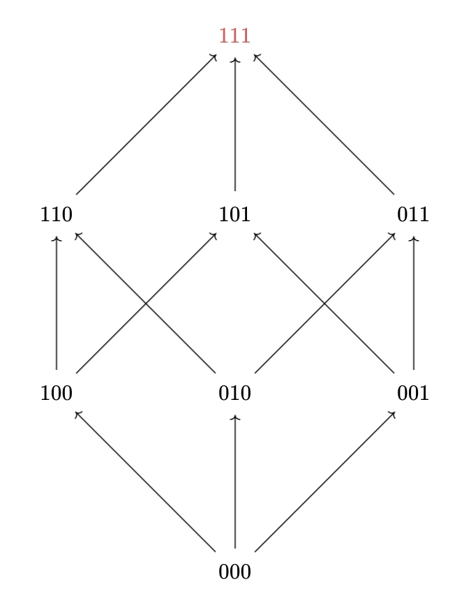{#fig:and3cube}

By contrast, the function $\oplus: \mathbb{B}^3 \rightarrow \mathbb{B}$ carves $\mathbb{B}^3$ into 8 continguous posets, or, to think of it another way, *connected components* of the 3-cube. This is also the function we call *odd-parity*. And we can see that it has the distinguishing feature of mincing up the hypercube as finely as possible -- a feature it exhibits as plainly on the 3-cube as it does on cubes of every dimension. Flipping a single bit will *always* change the value of the function.

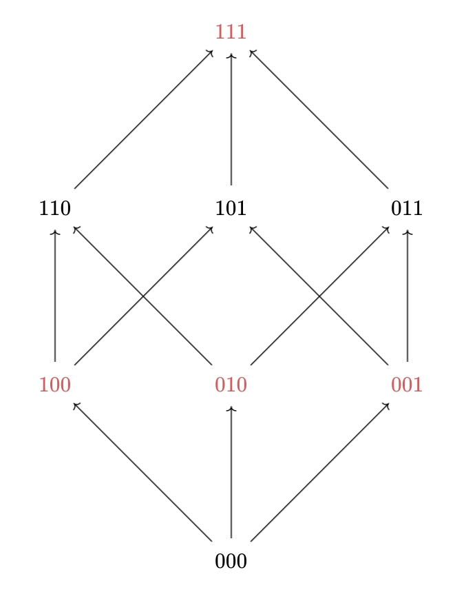{#fig:xor3cube}

Let's fix some terminology here: the structures that we're considering here can be seen as the Hasse diagrams of Boolean lattices, but since we're primarily concerned with their connective properties, from this point on we're just refer to them as *n-dimensional hypercubes graphs*, or just *hypercubes*.

Following this train of thought took us on a brief detour through the existing literature on the *sensitivity of boolean functions*. 


## From Sensitivity to Dirichlet Energy

The notion of measuring Boolean functions' "sensitivity", in the sense we're going to describe here, first surfaced in Noam Nisan's 1989 paper, "CREW PRAMS and Decision Trees" [[@Nisan1989CREWPRAMSDecision]]. What Nisan provides us with is as follows:

> Notation: let $w$ be a boolean string of length $n$, let $S$ be any subset of indices, $S \subset \{1 \cdots n \}$, then $w^{(S)}$ means the string $w$ with all bits in $S$ flipped. I.e., $w^{(S)}$ differs from $w$ exactly on $S$.

> **Definition**: Let $f$ be a boolean function, and $w$ any input string, and $i$ any index. We say that $f$ is *sensitive* to $x_i$ on $w$ if $f(w) \neq f(w^{(i)})$. The *sensitivity* of $f$ on $w$, $s_w(f)$, is the number of locations $i$ such that $f$ is sensitive to $x_i$ on $w$. The *sensitivity* of $f$, $s(f)$ is the **maximum** over all $w$ of the sensitivity of $f$ on $w$. (330)

This notion went on to spawn a cottage industry of theoretical computer science publications, predominantly concerned with whether or not a polynomial relation could be established between this measure of sensitivity and others, such as "certificate sensitivity" and "block sensitivity". These don't concern us here.

There are a few points where we might try to refine Nisan's definition, somewhat, or at least mould it into a shape that could be of more use to us. Instead of thinking of "input strings", let's place ourselves again in the hypercube, and consider each $w$ as a vertex. The other input strings $\left\{w^i ~|~ 0 <= i < \text{length}(w)\right\}$, each reachable from $w$ by flipping a single bit, are the *neighbours* of vertex $w$ in the hypercube (where edges represent bit-flips). Now instead of taking the *count* of neighbours $w^i$ of $w$ such that $f(w^i) \neq f(w)$, let's consider the sum of squared differences $\Sigma (f(w^i) - f(w))^2$. In a Boolean context, of course, these measures are so far equivalent. If $f(w^i)$ differs from $f(w)$ it can only be by an absolute value of 1, and so this sum is never equal to anything other than the count. The reason for rewriting things this way, in the end, is just to bring out the resemblance of Nisanian "sensitivity" to another more general property.

Anyone coming to Nisan's notion fo sensitivity in hopes of finding a property that might allow them to classify and distinguish between various Boolean functions might be disappointed to see how much information it simply throws away. It wantonly disposes of the fine-grained (and implicitly graph-theoretic) information that it gathers together under the rubric of "local sensitivity", only to take the *maximum* local sensitivity over the set of possible input strings (i.e., the vertices of the hypercube).


Let's go back to our examples of $\& : \mathbb{B}^3 \rightarrow \mathbb{B}$ and $\oplus : \mathbb{B}^3 \rightarrow \mathbb{B}$ (figures {@fig:and3cube} and {@fig:xor3cube}, respectively). These functions are equally "sensitive" in the Nisanian sense, because each has *at least one* vertex where *any* of three bitflips will change the value of the function. The difference, of course, is that in the case of `XOR`, *every* vertex has this property, whereas when it comes to `AND` only the top vertex, `111`, is so volatile. The rest have a local sensitivity of either 1 (in the case of `110`, `101`, and `011`) or 0, for the rest. This difference isn't difficult to capture: we *could* simply say that `XOR` -- or, to give it another name, *odd parity* -- induces a greater *average local sensitivity* on the vertices of the hypercube than `AND` does. In fact, we could observe that it's **maximal**: there is no function on $\mathbb{B}^3$ that could induce greater local sensitivity than `XOR`/$\oplus$/odd-parity. Every vertex already has a local sensitivity equal to the number of dimensions. 

If instead of taking the maximum local sensitivity over the vertices in the cube, we take the *mean* or *expected* local sensitivity, then we have something considerably more fine-grained in our hands: 

$$\frac{\sum_{v,v' \in V(\mathbb{G})}\{\left((f(v) - f(v')\right)^2  : v' \text{ is a neighbour of } v \text{ in } \mathbb{G}\}}{| E(\mathbb{G}) |}$$^energy-sketch

If this formula seems familiar, it's because what we're looking at now a measurement of the *Dirichlet energy* of a Boolean function over the hypercube graph.


### Measuring Dirichlet Energy

<!-- TRANSITION --> <!-- TODO: this should be easy to finish up today. going to do so after a few quick errands -->

In the code below, `HyperCube` is just an alias for a labelled graph type, which, in this context, is exclusively used to represent a $n$-dimensional Boolean cubes, where each vertex is labelled with a $n$-bit vector, and edges connect all and only those vertices whose vectors differ by a single bitflip. (That is to say, adjacent vertices stand at a hamming distance of 1 from one another.)

```julia
function local_energy(Q, v)::Rational
    f(x) = get_prop(Q, x, :value) |> Rational
    value = f(v)
    neighbourhood = f.(all_neighbors(Q, v))
    abs.(neighbourhood .- value) |> mean
end


function evaluate_on_hypercube!(f, Q::HyperCube)
    for v in vertices(Q)
        set_prop!(Q, v, :value, f(get_prop(Q, v, :bits)))
    end
    Q
end


function dirichlet_energy(f, dim)
    Q = hypercube(dim)
    evaluate_on_hypercube!(f, Q)
    (local_energy(Q, v) for v in vertices(Q)) |> mean
end
```

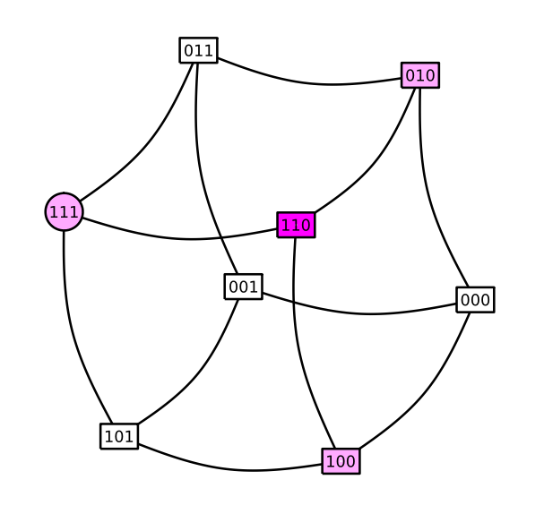{#fig:and-dirichlet-3-cube}

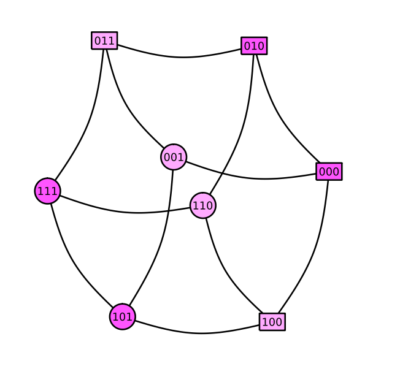{#fig:mux-dirichlet-3-cube}

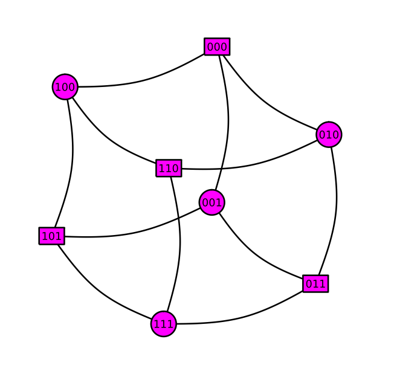{#fig:parity-dirichlet-3-cube}

<!-- motivate, define, give examples -->

<!-- diagrams, using the visualize_cube functions in the Sensitivity module. -->

## Dirichlet Energy Proximity as a Fitness Pressure

We returned to the parity problems with a composite fitness function in which the distance between the Dirichlet energy of the candidate function and that of the target figured as a heavily-weighted component -- the other components being the features that served us well in the multiplexor experiments: 


| Feature                    | Weight |
| -------------------------- | ------ |
| Dirichlet energy proximity | 0.65   |
| Shared Hamming distance    | 0.19   |
| Trace information          | 0.13   |
| Parsimony                  | 0.03   |

### Returning to the 11-bit Parity Problem

The 11-bit parity problem yielded readily to populations for which Dirichlet energy proximity to the target factored as a significant selective pressure, as can be seen in figures {@fig:parity11-trial1} and {@fig:parity11-trial2}.

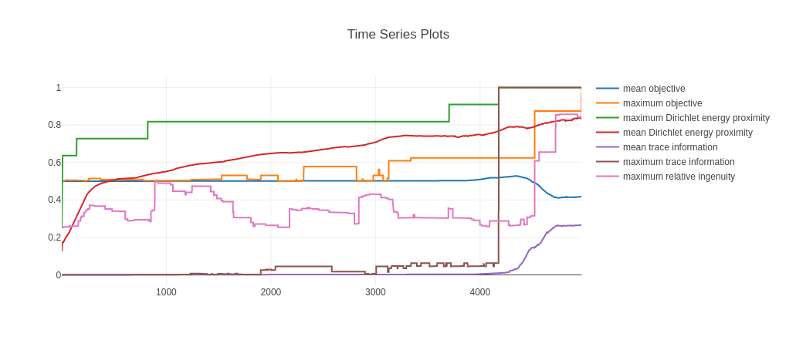{#fig:parity11-trial1}


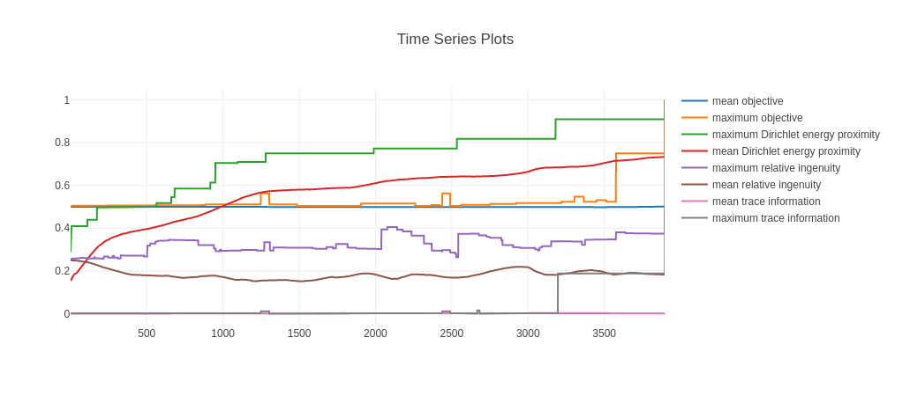{#fig:parity11-trial2}


#### Specimen RTL Code

The effective code for the champion of the second trial of the 11-bit parity experiment is shown below. The `xor` opcode features prominently here, which is unsurprising given that `xor` is nothing other than the 2-bit form of the odd parity function.

```
001.    R[04] ← R[04] xor D[05]
003.    R[05] ← R[05] & D[05]
006.    R[08] ← R[08] xor D[05]
007.    R[08] ← R[08] xor R[08]
009.    R[04] ← R[04] xor D[11]
011.    R[07] ← R[07] | R[05]
012.    R[07] ← R[07] | D[04]
013.    R[07] ← R[07] xor D[06]
015.    R[01] ← R[01] | D[02]
016.    R[07] ← R[07] xor R[01]
017.    R[05] ← ~ R[07]
018.    R[08] ← R[08] xor D[08]
022.    R[04] ← R[04] xor D[10]
023.    R[02] ← ~ D[07]
025.    R[04] ← R[04] xor R[08]
027.    R[02] ← R[02] xor D[01]
030.    R[06] ← ~ R[05]
033.    R[02] ← R[02] xor D[09]
035.    R[02] ← R[02] xor R[04]
036.    R[06] ← R[06] xor R[02]
039.    R[01] ← ~ R[06]
043.    R[01] ← R[01] xor D[03]
```


## 12-bit Parity

Increasing the dimension to 12 posed no serious challenge for the system, which has shown itself capable of consistently finding solutions in fewer than 10,000 tournaments (since the tournament size has been set to 6 in these experiments, that amounts to fewer than 60,000 individual evaluations).

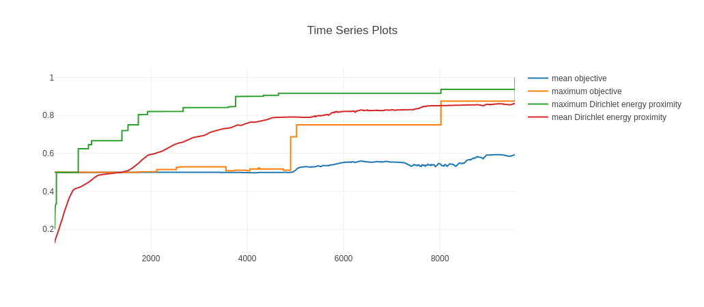


## 13-bit Parity

Even if we increase the dimension yet again, and move from a search space of $2^{2^{12}}$ functions (instantiated over an even greater number of programs) to one of $2^{2^{13}}$ functions, the Dirichlet energy gradient reliably guides us towards the parity function.

It may come as some surprise that the number of tournaments required to solve the 13-dimensional case scarcely appeared to exceed the number required to solve 12-dimensional parity. In our first stab at the 13-bit case, in fact, approximately 2000 *fewer* tournaments were needed than were needed in the 12-bit case (see figure {@fig:parity-13}). It would be even more surprising if this result surived a statistically significant number of trials, though it is *plausible* that a reduction in the necessary number of tournaments could result from the doubling of the size of the training set that occurs when we increase the dimension of the function.

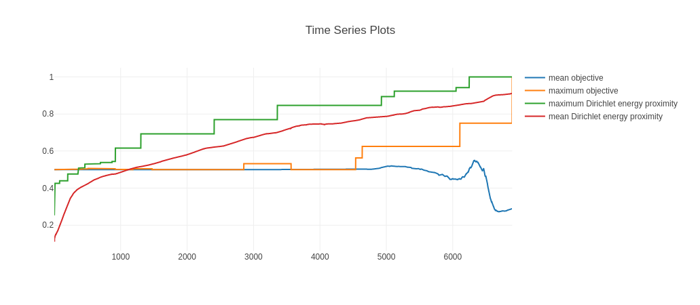{#fig:parity-13}

The solution in this particular trial came from the island whose interaction matrix is presented in the lower left quadrant of figure {@fig:parity13im}. This is, among other things, a striking example of the difference in the fitness landscapes furnished by Dirichlet energy measurements on the one hand, and the Hamming distance metric most often used in Boolean symbolic regression.

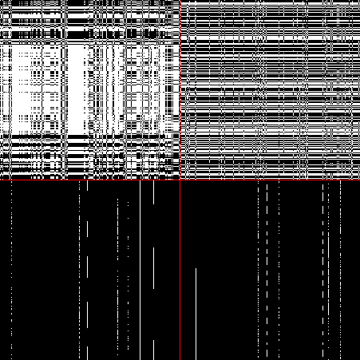{#fig:parity13im}


<!-- And we can expect the performance of Dirichlet energy proximity, as a fitness function, to be proportionate to the distance of the target function's energy from 0.5 -- the peak of the binomial distribution of energy across functions. -->


### The Shape of the Dirichlet Energy Distribution

It would be unreasonable, of course, to expect the Dirichlet energy gradient to furnish a royal road to just *any* Boolean function. Its power in providing a path to the parity functions depends on the parity functions belonging to a very small class of *Dirichlet energy maximizers* -- mirrored by an equally small, but computationally simpler, class of *Dirichlet energy minimizers*, which are just the constant functions: $(\lambda x . 1)$ and $(\lambda x . 0)$.

What's of interest here is that Dirichlet energy provides a gradient for functions that have eluded our other, general purpose fitness functions -- namely, shared hamming distance and trace information. There is, after all, no free lunch, and it would be mistaken to expect any particular gradient is the gradient to rule them all. The performance of every possible fitness function averages out equally, when considered across the entire domain of functions.

We conjecture that the difference between a candidate function's Dirichlet energy and the energy of the target function can provide us with an extremely powerful search gradient *so long as functions with an energy equal to that of the target function are rare*. The parity functions are, in this respect, truly ideal targets.

But what does the distribution of Dirichlet energy over the general space of $n$-dimensional Boolean functions look like?

In low-dimensional spaces, like the 3-cube, we can answer this question through the admittedly lazy method of brute force. The histogram shown in {@fig:energy-histogram-3cube} illustrates what appears to be a *binomial distribution* of Dirichlet energy over the 256 Boolean functions on the 3-dimensional cube.

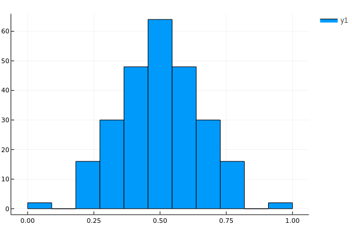{#fig:energy-histogram-3cube}

We are rarely dealing with the *totality* of functions on the $n$-cube, however, especially when $n$ is even moderately large. There are, for example, exactly $2^{2^{13}}$ Boolean functions on the 13-cube. (Even the relatively small 9-cube hosts more Boolean functions than our universe does atoms.) And the set of programs that instantiate these functions, and which can be constructed with the program constructors at our disposal, will tend to be even larger, depending on various parameters (the number of operations and registers available, the maximum length of programs, and so on).

It may be interesting to inquire, then, about the distribution of energy over *samples* from the set of $n$-dimensional functions when the sampling policy is not uniform.

We can consider, for example, three distinct ways of generating a "random function" $f: \mathbb{B}^n \rightarrow \mathbb{B}$:

1. we could first generate a random Boolean vector `v`, with uniform probability, and then, while holding `v` fixed, use it as a "lookup table" for the function, by interpreting the function's parameters as the binary expression of the integer `i` and returning `v[i]`. It's clear that, so long as the bits composing `v` can be sampled uniformly, so can the space of functions. In the plots below, we'll refer to this method of generated random functions as *Uniformly sampled tables*.
2. we could recursively generate *expressions* as abstract syntax trees, using the same program generation algorithms used by Koza in [@Koza2005GeneticProgramming]. The function `f`'s parameters are then bound to the free variables in the expression and the expression is evaluated. `f` then returns the result of this evaluation. In the plots that follow, we'll refer this function generator with the abbreviation *AST*, followed by a specification of the maximum depth of the tree and the primitive operations, or nonterminals, used.
3. finally, we could employ the algorithms that we're already using in Cockatrice to generate random vectors of register-transfer language (or "virtual assembly") instructions, and then execute the instruction vector or "program" in the virtual machine that Cockatrice uses to evaluate candidate programs (i.e., to establish the genotype-phenotype map). Whatever value is contained by the return register, `R1`, is then returned by `f`.


The distribution of Dirichlet energy over sets of functions produced by each of these random generators (yielding 1000 samples each, with replacement) can be seen in figures {@fig:randomfunc3} through {@fig:randomfunc10}. What we find there is a pattern that appears to be fairly robust with respect to variations in program length (for the function generators of type 3) and expression depth (for function generators of type 2), as well as variations in the choice of primitive operations. In each case, the distribution of energy approximates a normal distribution with variance proportionate to dimension. The two non-uniform varieties of random function generator are biased in the direction of low-energy functions. This bias is far more pronounced in the case of the RTL function generator than its AST counterpart.


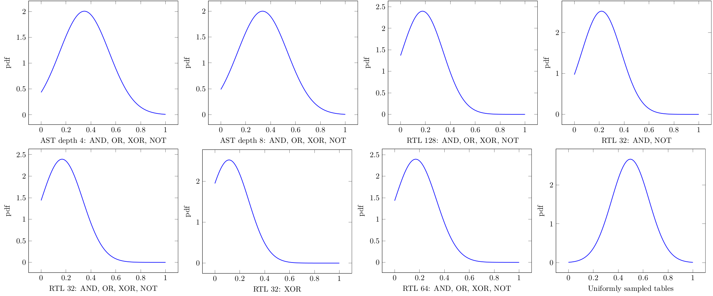{#fig:randomfunc3}

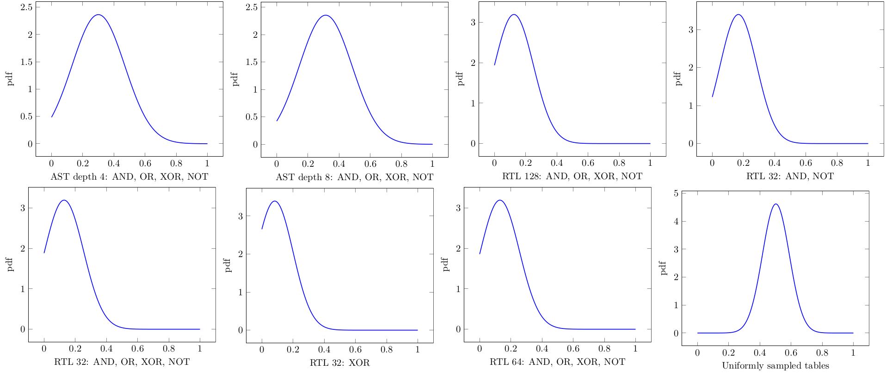{#fig:randomfunc4}

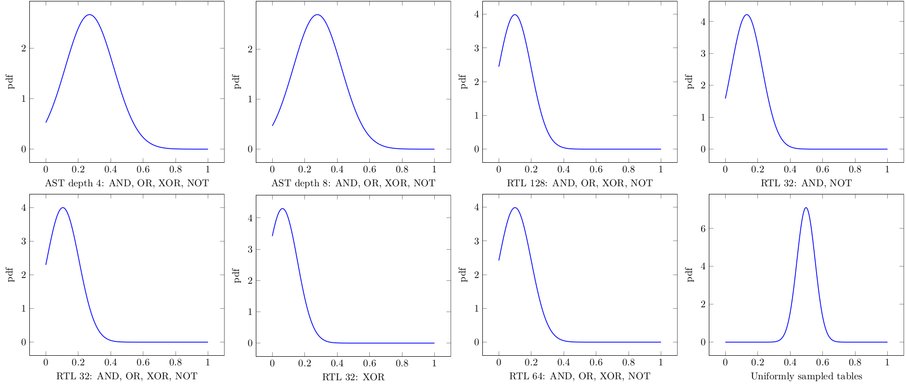{#fig:randomfunc5}


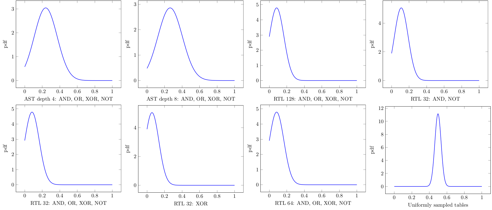{#fig:randomfunc6}

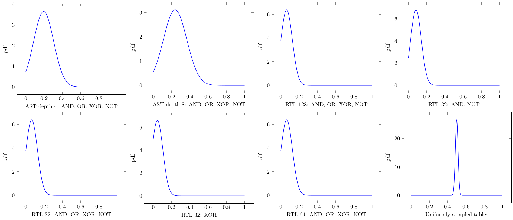{#fig:randomfunc8}


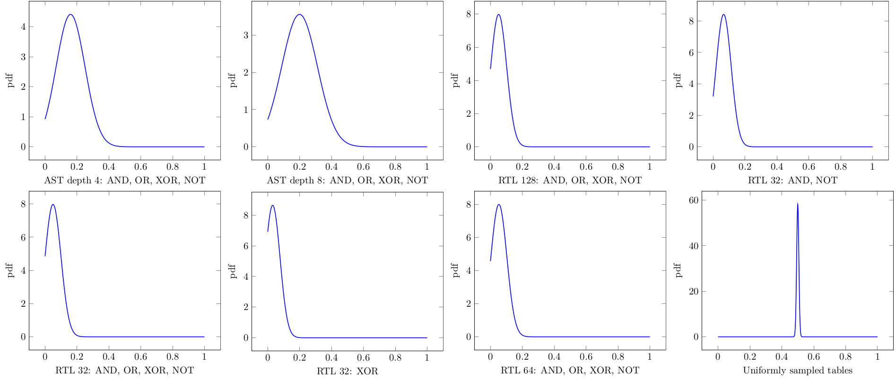{#fig:randomfunc10}


This is significant insofar as the REFUSR GP engine, itself, represents functions through RTL instruction sequences. It is not difficult, however, to evolve a random population of programs towards higher energy distributions. If, for example, we initialize a population of random programs using the RTL program generator, and then let the fitness function simply be the Dirichlet energy measure of each candidate program -- thereby rewarding the maximization of Dirichlet energy -- then we can swiftly steer the distribution towards a more or less *normal* state, and, if we persevere, towards a state that is *highly* biased towards high energy functions. <!-- TODO I need the plots for this. reopen the pluto notebook if needed. -->

In figures {@fig:population-energy-0} through {@fig:population-energy-1000}, we can see (through approximate fittings) how Dirichlet energy is distributed across a population of 100 programs (each implementing a 6-dimensional Boolean function) over the course of its evolution, where the sole selective pressure is a the pressure to maximize Dirichlet energy.

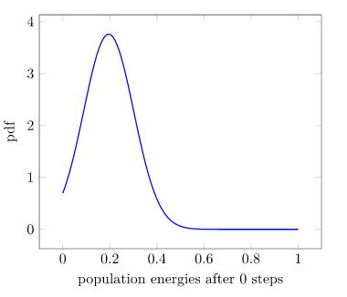{#fig:population-energy-0}

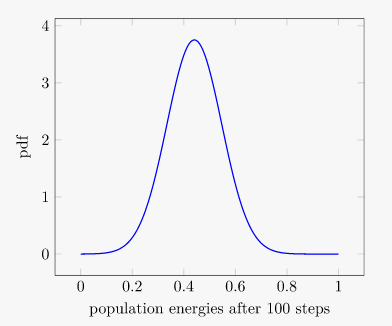{#fig:population-energy-100}

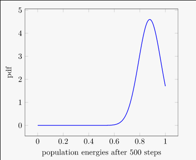{#fig:population-energy-500}

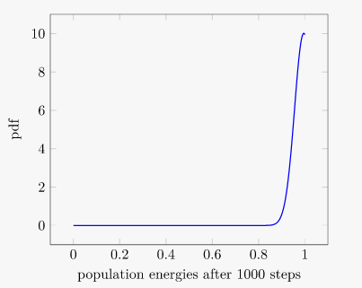{#fig:population-energy-1000}


# Adaptive Sampling for Property Testing and Function Fingerprinting

To build on work on junta testing to embrace the testing of other properties that might be of value in characterizing and comparing general functions, we both considered testing methodologies for specific properties, and for general property testing. General property testing in terms of adaptive sampling procedures proved to be a useful technique in developing our novel adaptive sample set construction technique for function characterization, which is based on the sensitivity information yielded by the junta tester's search.

The approach uses concepts from the general purpose function property testing methodology in Chapter 6 of Oded Goldreich, _Introduction to Property Testing_, 2021; and also draws on ideas about function sensitivity measures to augment the existing junta tester with the ability to characterize a function based on local rather than global properties, which yields more information and can be implemented in a simpler and more efficient way than the general property tester. 

We have implemented an adaptive method for characterizing functions by testing _pointwise properties_ i.e. local properties of the function defined in terms of the perturbation of a single bit of a point in the domain of the binary function being characterized.

Previous work developed a tester for a fundamental nontrivial property of boolean functions: the junta property. A subset of size _k_ of a function's inputs are said to form a _k_-junta when knowing that subset is sufficient to determine the output of the function for all inputs. Thus, determining this property permits one to restrict the search space for other properties to only those inputs known to influence the output of the function, since inputs outside the junta set can be ignored as they do not influence the function's output at any point in the input space.

The testing of the junta property was a useful starting point for several reasons:
 - First, it provides information about where in the input space the function's output is sensitive to certain perturbations of its input, which is useful information for identifying and comparing functions, and for reducing the space of searches associated with these queries. This notion of sensitivity is related to the Nisan sensitivity and Dirichlet energy measures used elsewhere in the project.
 - Second, the state of the art algorithm for junta testing we chose for implementation is able to adapt its sampling strategy to both the function under study and the input distribution of interest, which is useful for focusing the search effort in the junta checking itself and in the generation of samples for other queries that may benefit from a bias toward the sensitive samples generated by the junta search.
 - Third, the vector of sensitive input positions is itself a generally informative property that can be used to characterize and distinguish functions without assuming much about them.

## Pointwise property testing

In order to take advantage of previous work on junta testing to support the identification of general functions, the notion of a pointwise property test was defined and used to implement a sampling-based approach to property testing at individual input points. A _pointwise property_ is one that can be defined in terms of the behavior of the function under study at single input points. It includes many properties of interest, notably 1-monotonicity.

_k_-monotonicity is defined such that a function _f_ is said to be _k_-monotonic if, given an ordering relation _≤_ on inputs, and the function _f_, for all sequences of inputs x_i, for all i, x_(i-1) ≤ x_i, then f(x_i) ≠ f(x_(i-1)) at most _k_ times. In the case of 1-monotonicity, checking sequences of length 1, that is, perturbations of a single input at a single bit, suffice to establish the property locally in the neighborhood of the original and perturbed inputs.

This observation inspired the following approach to function identification by computing fingerprints based on pointwise property behavior at sensitive points.

## Pointwise test-based function fingerprinting

Based on the junta tester's operation in terms of a search for inputs that, when perturbed at a single bit position, yield a change in the output, testing of arbitrary properties at such points was implemented. The junta tester now takes an optional parameter of a predicate to test at all such found points, and returns a log of the result of testing the predicate between the original and perturbed point.

This log is then condensed into an approximately information-preserving fixed dimensional binary vector that serves as a signature of the function's pointwise property behavior, by means of which functions can be compared directly in terms of where in their input spaces the pointwise property under consideration does or does not hold.
    
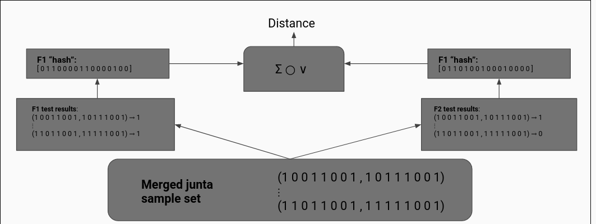{#fig:fingerprints}

The fingerprinting process is outlined in psuedo-code below.

1. The junta sampler yields a set of _sensitive input points_
2. Properties are tested in these local neighborhoods as described above
3. These (point, point, property) tuples are hashed.
4. The hash is used to compute a fixed size bit pattern with few set bits.
5. The patterns of each (point, point, property) tuple are combined into a composite vector of the same fixed dimension representing function behavior on the entire sample set according to techniques in Kanerva 2009, _Hyperdimensional Computing_. This vector is the_function fingerprint_. 
6. Two functions are compared by measuring the distance between their fingerprint vectors on the same sample set. 

## Future Work

In addition to 1-monotonicity, fingerprinting based on other properties, as well as fingerprinting in terms of the function output itself, may be developed according to what proves informative in the genetic search for function identification or other use contexts.

We are considering other uses for the fingerprinting module besides the main impetus for development, including stand-alone tools and modules for other tools such as Binwalk.

We may also be able to develop and exploit a better understanding of the relationships between the pragmatic notion of binary function sensitivity that informs the junta search and the aforementioned Nisan sensitivity and Dirichlet energy. The junta search's use of single-point perturbation sensitive samples is a more local version of those sensitivity measures, which consider the entire neighborhood of single-bit perturbations at a given input point.

# Works Cited
